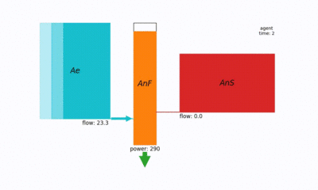

## A New Pathway to Approximate Energy Expenditure and Recovery of an Athlete



### Usage

Please see the corresponding paper for further references. If you make use of this project, we would be greatful if 
you star the repository and/or cite our paper.
```
@misc{weigend2021new,
      title={A New Pathway to Approximate Energy Expenditure and Recovery of an Athlete}, 
      author={Fabian Clemens Weigend and Jason Siegler and Oliver Obst},
      year={2021},
      eprint={2104.07903},
      archivePrefix={arXiv},
      primaryClass={cs.NE}
}
```

### Setup And Hints

We recommend the use of a virtual environment. Simply install the package by running `pip3 install <path_to_project_root>`

Required packages are listed in `requirements.txt` and should be installed automatically:
```
matplotlib
pygmo
```

If you use pycharm professional, please ensure that the SciView tab is deactivated when running interactive animations.
```
File => Settings => Tools => Python Scientific => Uncheck "show plots in tool window"
```

### Example Applications

Following demo applications are available via scripts in the base directory

* `interactive_simulation.py` lets you experiment with an exemplary three component hydraulic agent and 
investigate its responses to various power demands.

* `model_behaviour_plots.py` recreates the energy expenditure and recovery plots of the results section of the paper.

* `grid_search_evolutionary_parameters.py` starts a grid search over described parameter settings for MOEA/D coupled 
  with the asynchronous island model by Pygmo. One fitting per parameter combination as summarised in Table 3 of the Appendix 
  are estimated. Results are stored into a `data-storage` folder next to the root directory of the project.
  
* `evolutionary_fitting` Runs 10 fittings on an athlete usinig the in the script defined parameters for CP, W' and recovery 
  rations by Caen et al. The script uses the published set of best fitting parameters (30 generations, 
  40 cycles, 64 population size, 7 islands) to fit the model with the outlined evolutionary computation approach 
  (see Appendix B and C). Results are stored into a `data-storage` folder next to the root directory of the project.

* `pygmo_fittings_report` Iterates over all evolutionary fitting results stored in the `data-storage` directory and creates
  a readable `.json` overview over best fitting results, algorithm parameters, execution time, etc.