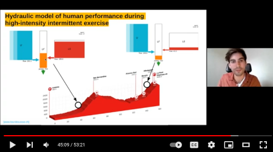

[](https://www.youtube.com/watch?v=OGiv_frvM6g)

# threecomphyd

[](https://pypi.python.org/pypi/threecomphyd)

This package provides tools to model performance of athletes. The name `threecomphyd` stands for
__Three Component Hydraulic__ and describes the performance modeling approach in focus.

Example scripts in the [GitHub repository](https://github.com/faweigend/three_comp_hyd) serve as instructions on how to
use this package. We provide a simulation agent and example simulations, functionalities for debug plots, and an
evolutionary fitting process to fit a model to individual athletes.

### Publication

Please see the corresponding paper on [__ACM__](https://dl.acm.org/doi/10.1145/3449726.3459469) or the prerpint on
[__ArXiv__](https://arxiv.org/abs/2104.07903) for further references. If you make use of this project, 
we would be grateful if you star the repository and/or cite our paper.

```
@inproceedings{10.1145/3449726.3459469,
      author = {Weigend, Fabian Clemens and Siegler, Jason and Obst, Oliver},
      title = {A New Pathway to Approximate Energy Expenditure and Recovery of an Athlete},
      year = {2021},
      isbn = {9781450383516},
      publisher = {Association for Computing Machinery},
      address = {New York, NY, USA},
      url = {https://doi.org/10.1145/3449726.3459469},
      doi = {10.1145/3449726.3459469},
      pages = {325–326},
      numpages = {2},
      keywords = {optimization, performance modeling, metabolic response modeling},
      location = {Lille, France},
      series = {GECCO '21}
}
```

### Setup

If you simply want to use the package, you may want to install it via `pip3 install threecomphyd` without the need for a
manual download.

If you downloaded the source files, e.g., from this [GitHub repository](https://github.com/faweigend/three_comp_hyd),
you can install the project with a similar procedure as a package by running `pip3 install -e <path_to_project_root>`.

### Usage Hints

Some hints on how to handle provided example applications in the `example_scripts` directory.

#### Tkinter on Linux Systems

On Linux systems make sure `tkinter` for python3 is installed via the package manager to be 
able to see plots and animations.

#### SciView in Pycharm-Professional
If you use pycharm professional, please ensure that you deactivate the `SciView` tab when running interactive
animations.

```
File => Settings => Tools => Python Scientific => Uncheck "show plots in tool window"
```

#### Set Data-Storage Directory
The scripts `pygmo_fittings_report.py`, `grid_search_evolutionary_parameters.py`, and `evolutionary_fitting.py` read and
write files to the system. They will use the location indicated in `config.py` to write to and read from. By default
this is the location where you run the scripts from, but you can change it by setting the `data_storage` entry. Check in
the example scripts how to do it.

### Example Applications

Following demo applications are available via scripts in the `example_scripts` directory

* `interactive_simulation.py` lets you experiment with an exemplary three component hydraulic agent and investigate its
  responses to various power demands.

* `model_behaviour_plots.py` recreates the energy expenditure and recovery plots of the results section of the paper.

* `pygmo_fittings_report.py` Iterates over all evolutionary fitting results stored in the `data-storage` directory
  defined in `config` and creates a readable `.json` overview over best fitting results, configurations, algorithm
  parameters, execution time, etc.

WARNING! the following scripts require a system with a minimum of 7 CPU cores for the evolutionary fitting, or even 21
CPU cores for the grid search approach.

* `grid_search_evolutionary_parameters.py` starts a grid search over described parameter settings for MOEA/D coupled
  with the asynchronous island model by Pygmo. One fitting per parameter combination as summarised in Table 3 of the
  Appendix are estimated. Results are stored into a `data-storage` folder in the root directory of the project.

* `evolutionary_fitting.py` Runs 10 fittings on an athlete using the in the script defined parameters for CP, W' and
  recovery rations by Caen et al. The script uses the published set of best fitting parameters (30 generations, 40
  cycles, 64 population size, 7 islands) to fit the model with the outlined evolutionary computation approach
  (see Appendix B and C). Results are stored into a `data-storage` folder in the root directory of the project.

